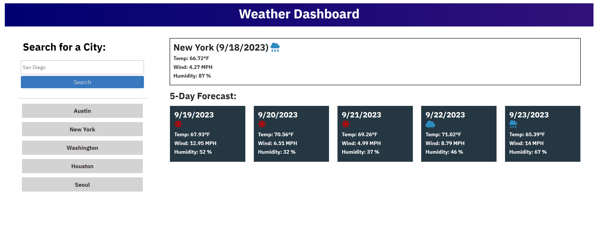

# weatherDashboard

  * Author: Kyosook Shin
  * Author's Email: kyosook.shin@gmail.com
  * Deployed URL: https://alla0810.github.io/weatherDashboard/
  * GitHub: https://github.com/alla0810/weatherDashboard
  * screenshot

## Source Code References
  This project has used some reference codes from the following sites

   * https://git.bootcampcontent.com/University-of-Texas-at-Austin/UTA-VIRT-FSF-PT-07-2023-U-LOLC.git   

   
## User Story

AS A traveler
I WANT to see the weather outlook for multiple cities
SO THAT I can plan a trip accordingly

## Acceptance Criteria

GIVEN a weather dashboard with form inputs

* WHEN I search for a city, THEN I am presented with current and future conditions for that city and that city is added to the search history

* WHEN I view current weather conditions for that city, THEN I am presented with the city name, the date, an icon representation of weather conditions, the temperature, the humidity, and the wind speed

* WHEN I view future weather conditions for that city, THEN I am presented with a 5-day forecast that displays the date, an icon representation of weather conditions, the temperature, the wind speed, and the humidity  

* WHEN I click on a city in the search history, THEN I am again presented with current and future conditions for that city
  
## Mock-Up
The following image shows the application's appearance and functionality

## Technical Acceptance Criteria: 40%

Satisfies all of the above acceptance criteria plus the following:
* Uses the OpenWeather API to retrieve weather data
* Uses localStorage to store persistent data

## Deployment: 32%

* Application deployed at live URL.
* Application loads with no errors.
* Application GitHub URL submitted.
* GitHub repository that contains application code.

## Application Quality: 15%

* Application user experience is intuitive and easy to navigate
* Application user interface style is clean and polished.
* Application resembles the mock-up functionality provided in the Challenge instructions.

## Repository Quality: 13%

* Repository has a unique name.
* Repository follows best practices for file structure and naming conventions.
* Repository follows best practices for class/id naming conventions, indentation, high-quality comments, etc.
* Repository contains multiple descriptive commit messages.
* Repository contains a high-quality README file with description, screenshot, and link to deployed application.
